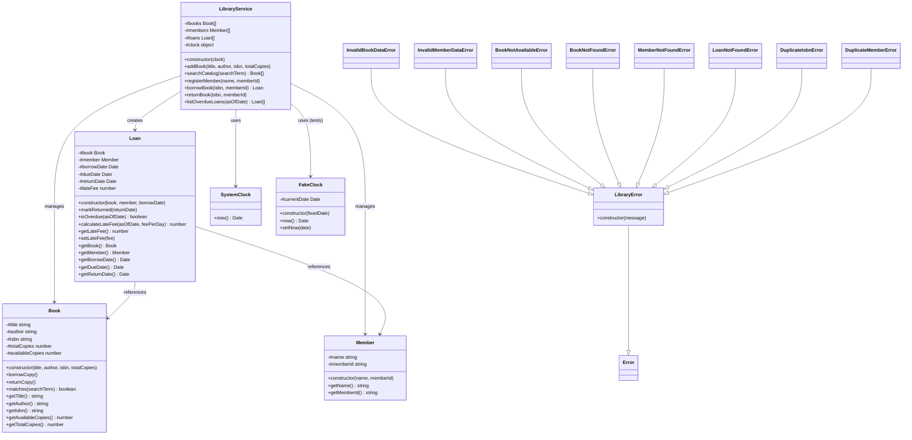

# LMS-Lite — Class Diagram

## Mermaid Diagram



## Text Diagram (for contexts where Mermaid is not rendered)

```
LibraryService
 ├── #books: Book[]
 ├── #members: Member[]
 ├── #loans: Loan[]
 ├── #clock: SystemClock | FakeClock
 │
 ├── addBook()        → creates Book
 ├── searchCatalog()  → filters Book[]
 ├── registerMember() → creates Member
 ├── borrowBook()     → creates Loan
 ├── returnBook()     → updates Loan, restores Book
 └── listOverdueLoans() → filters Loan[]

Loan
 ├── #book: Book      → reference to borrowed book
 ├── #member: Member  → reference to borrower
 ├── #borrowDate, #dueDate, #returnDate: Date
 ├── #lateFee: number
 ├── calculateLateFee() → days × feePerDay
 └── isOverdue()        → returnDate == null && asOf > dueDate

Book
 ├── #title, #author, #isbn: string
 ├── #totalCopies, #availableCopies: number
 ├── borrowCopy()   → availableCopies--
 └── returnCopy()   → availableCopies++ (capped)

Member
 ├── #name: string
 └── #memberId: string

Exception Hierarchy
 Error
  └── LibraryError
       ├── InvalidBookDataError
       ├── InvalidMemberDataError
       ├── BookNotAvailableError
       ├── BookNotFoundError
       ├── MemberNotFoundError
       ├── LoanNotFoundError
       ├── DuplicateIsbnError
       └── DuplicateMemberError

Clock (duck-typed interface)
 ├── SystemClock.now()  → new Date()
 └── FakeClock.now()    → fixed injected date
```

## Relationships

| Relationship | Type | Description |
|---|---|---|
| `LibraryService` → `Book` | Composition (manages) | Service creates and stores books in an internal array. |
| `LibraryService` → `Member` | Composition (manages) | Service creates and stores members. |
| `LibraryService` → `Loan` | Composition (creates) | Service creates loans and tracks them. |
| `Loan` → `Book` | Aggregation (references) | Loan holds a reference to the borrowed book. |
| `Loan` → `Member` | Aggregation (references) | Loan holds a reference to the borrowing member. |
| `LibraryService` → `Clock` | Dependency (injection) | Service receives a clock via constructor injection. |
| All exceptions → `LibraryError` | Inheritance | Custom exceptions form a hierarchy rooted at `LibraryError`. |

## Design Notes

- **All model fields are private** (`#` prefix). Public access is through getters and specific mutation methods.
- **Clock is injected**, not created internally. This is the test-double seam that allows `FakeClock` to replace `SystemClock` in tests.
- **LibraryService is decomposed** into private helper methods (`#findBookOrThrow`, `#assertAvailable`, `#createLoan`, `#findActiveLoanOrThrow`, `#applyLateFee`, `#closeLoan`) rather than being a monolithic class.
